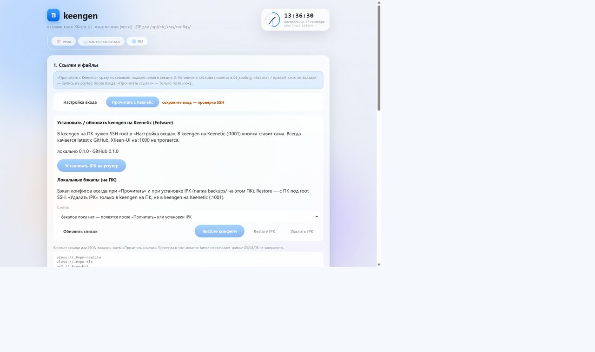
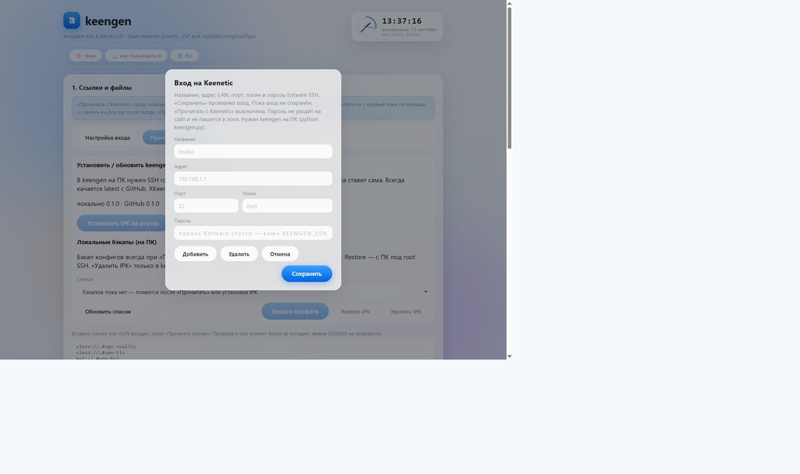
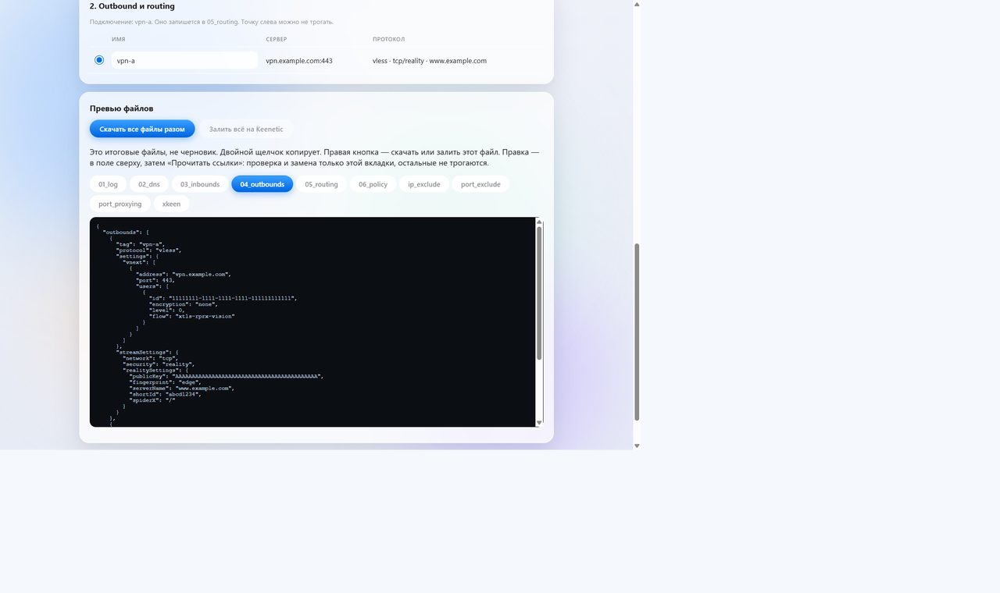

# keengen

Генератор и редактор конфигов **XKeen / Xray** для роутеров **Keenetic**: из share-ссылок в JSON вкладок, с чтением и заливкой на роутер.

Работает в браузере (статика) или как **keengen на ПК** на Windows / Linux / macOS. На Keenetic с Entware можно поставить пакет **IPK** — тот же UI как **keengen на Keenetic**.

Основная ветка — **`main`** (IPK, бэкапы, keengen на ПК и на Keenetic). Релизный пакет: [GitHub Releases](https://github.com/vanuska/keengen/releases/latest).

Совместим с панелью [XKeen-UI](https://github.com/zxc-rv/XKeen-UI). keengen **не заменяет** XKeen-UI: панель XKeen остаётся на порту **1000**, keengen на Keenetic (если установлен IPK) — на **1001**.

---

## Скриншоты

<p align="center">
  
  
  
</p>

1. Вставка ссылок / QR / JSON · «Прочитать с Keenetic»  
2. Вход по Entware SSH (только LAN, private IP)  
3. Превью вкладок 01–06 и списков · заливка на роутер  

Подробный сценарий без SSH: [docs/howto.md](docs/howto.md).

---

## Два режима

| | **keengen на ПК** | **keengen на Keenetic** |
|---|---|---|
| Как открыть | `start.bat` / `python3 start.py` → [http://127.0.0.1:8765](http://127.0.0.1:8765/) | `http://<router>:1001/` |
| Связь с роутером | SSH (paramiko) на LAN | Локальные файлы, SSH с ПК не нужен |
| Установка / обновление IPK | Кнопка в UI (нужен логин **root**) | Та же кнопка — ставит/обновляет локально |
| Бэкапы на ПК + Restore / «Удалить IPK» | Да (`backups/` рядом с keengen на ПК) | Нет (секция скрыта: нельзя снять пакет с самого себя) |
| XKeen-UI | Без изменений, обычно `:1000` | Без изменений, `:1000` |

Статика без keengen на ПК (ZIP / GitHub Pages): генерация и скачивание файлов работают; кнопки Keenetic будут «не дома» — это ожидаемо.

---

## Быстрый старт (keengen на ПК)

```bash
git clone https://github.com/vanuska/keengen.git
cd keengen
python3 start.py
```

| ОС | Запуск |
|---|---|
| Windows | `start.bat` |
| Linux / macOS | `python3 start.py` или `./start.sh` |

Скрипт создаёт `.venv`, ставит зависимости (в т.ч. `paramiko`) и открывает UI.  
Нужен **Python 3**; на Debian/Ubuntu ещё пакет `python3-venv`. Каталог `.venv` между ОС не копируйте.

Откроется [http://127.0.0.1:8765/](http://127.0.0.1:8765/).  
По умолчанию `--bind` = loopback. На `0.0.0.0` без нужды не слушайте: SSH API окажется в LAN.

**Для SSH к роутеру** нужны логин, пароль (или ключ) и порт **Dropbear Entware** — те, что задавали при установке XKeen / Entware. Типично: пользователь `root`, порт `22` (это не порт KeeneticOS `:2222`).

Пустой пароль в форме = переменная окружения `KEENGEN_SSH_KEY`. keengen на ПК ходит **только на private IP**.

---

## Ссылки → конфиги (основной поток)

XKeen-UI остаётся на Keenetic. keengen готовит JSON, который попадает в `/opt/etc/xray/configs/` и поднимается ядром Xray.

1. Вставьте share-ссылки (`vless://`, `hy2://`, `trojan://`, `vmess://`, `ss://`), QR или `.txt`.  
   Подписку `https://…` **не** вставлять — ядро Xray URL не тянет.
2. «**Прочитать ссылки**» — в таблице появятся outbound’ы.
3. Radio — какой тег активен в `05_routing.json`.
4. «**Скачать все файлы разом**» → положите в `/opt/etc/xray/configs/` → `xkeen -restart`  
   **или** с keengen на ПК: «**Залить всё на Keenetic**» (бэкап → запись → опционально restart).
5. Проверка: выбранные сайты через прокси, остальное `direct`.

Несколько ссылок = несколько outbound в **одном** `04_outbounds.json` (+ `direct` + `block`).

Можно перетащить готовый JSON вкладки 01–06 или `.lst` (`ip_exclude` / `port_exclude` / `port_proxying` / `xkeen`) — формат определяется сам. Битое не попадает в превью; живые 03/04/05 при разборе ссылок не затираются целиком.

### Что принимает Xray

| Вход | Xray 26.1.23+ | Для сравнения: Mihomo |
|---|---|---|
| `vless://` `hy2://` `trojan://` `vmess://` `ss://` | да → outbound JSON | да → YAML |
| `https://…` подписка | **нет** | да, proxy-providers |

Hysteria2 в Xray — с **v26.1.23**. Старый Xray JSON примет, ядро может не поднять.

---

## Чтение и запись на Keenetic

### Настройка входа (keengen на ПК)

«**Настройка входа**» → название профиля, адрес LAN (например `192.168.1.1`), порт Entware SSH, логин, пароль → **Сохранить** (probe SSH).

Пока probe не ок, «Прочитать с Keenetic» выключена. Пароль не уходит на GitHub Pages и не пишется в логи keengen на ПК.

### Прочитать с Keenetic

Подтягивает файлы `01`–`06` и списки XKeen с роутера в UI.  
**Одновременно** делается автоматический бэкап конфигов (см. ниже).

### Залить

«Залить всё» или ПКМ по вкладке → «Применить на Keenetic»:

1. Бэкап текущих файлов на роутере (`/tmp/keengen-backup-*`).
2. Запись выбранных файлов.
3. По желанию `xkeen -restart` (VPN может моргнуть на секунду).

В keengen на Keenetic (`:1001`) тот же сценарий, но без SSH: приложение читает/пишет локальные пути.

---

## Автоматические бэкапы и восстановление

### Когда делается бэкап

| Событие | На роутере | На ПК (`backups/` рядом с keengen на ПК) |
|---|---|---|
| «Прочитать с Keenetic» | слепок configs + xkeen (обычно `/opt/backup/keengen-…`) | да, `configs.tgz` + `meta.json` |
| Установка / обновление IPK | слепок перед `opkg` | да (+ копии `.ipk`, если ставили с ПК) |
| «Залить» / Apply | `/tmp/keengen-backup-*` | нет (только на роутере) |
| «Удалить IPK» (с ПК) | слепок перед `opkg remove` | да |

### Restore и снятие пакета — **только с keengen на ПК**

В секции «Локальные бэкапы (на ПК)» (в keengen на Keenetic на `:1001` эта секция **скрыта**):

- **Restore конфиги** — вернуть `/opt/etc/xray/configs` и `/opt/etc/xkeen` из слепка, затем restart XKeen.
- **Restore IPK** — откатить пакет из сохранённого `.ipk` в слепке.
- **Удалить IPK** — `opkg remove keengen` по SSH под **root** (сначала бэкап). UI на `:1001` исчезнет; XKeen и конфиги Xray не предназначены к удалению этой кнопкой.

Нужен сохранённый вход с логином **root**.

---

## Установка на Keenetic (keengen на Keenetic)

Пакет ставит UI + бинарный `keengen-httpd` на порт **1001**.  
XKeen-UI на **:1000** не трогается. После установки SSH с ПК для повседневной правки конфигов не обязателен.

Сборка и пути: [docs/ipk.md](docs/ipk.md).

### Что нужно

- Keenetic с **Entware** на USB / `/opt` (пакет ~2 МБ + рабочие файлы).
- Архитектура Entware **mipsel-3.4** (готовый релизный пакет под неё; другие arch — своя сборка).
- Уже установлен **XKeen** (`/opt/etc/xray/configs`, списки в `/opt/etc/xkeen`).
- Для установки **с ПК**: SSH Dropbear Entware, логин **root**.

### Откуда взять `.ipk`

Стабильное имя ассета latest:

`https://github.com/vanuska/keengen/releases/latest/download/keengen_mipsel-3.4.ipk`

Версия приложения = файл [`VERSION`](VERSION) + тег Release.  
Сборка из исходников: [docs/ipk.md](docs/ipk.md) → файл в `dist/`.

### Из UI (рекомендуется)

1. На ПК: `start.bat` / `python3 start.py`.
2. «Настройка входа» → `root`, LAN-IP роутера, порт `22` → Сохранить.
3. **«Установить IPK…»** / **«Обновить IPK до …»** — всегда качает **GitHub latest** (HTTPS на ПК), бэкап → `opkg` → проверка `:1001`.
4. Строка версий: keengen на ПК · GitHub · версия на роутере (если уже стоит).
5. В keengen на Keenetic (`:1001`) кнопка обновляет пакет **без SSH** (скачивание на самом роутере).

### One-liner по SSH (предпочтительно `curl`)

Busybox `wget` на Entware часто **без HTTPS** — one-liner через wget с GitHub обычно не сработает. Лучше кнопка в keengen на ПК или `curl`:

```sh
curl -fsSL -o /tmp/keengen_mipsel-3.4.ipk \
  "https://github.com/vanuska/keengen/releases/latest/download/keengen_mipsel-3.4.ipk" \
  && opkg install /tmp/keengen_mipsel-3.4.ipk \
  && /opt/etc/init.d/S99keengen start
```

UI: `http://<router>:1001/`

### С ПК через scp

```sh
scp keengen_mipsel-3.4.ipk root@192.168.1.1:/tmp/
ssh root@192.168.1.1
opkg install /tmp/keengen_mipsel-3.4.ipk
/opt/etc/init.d/S99keengen start
```

### Первый заход на `:1001`

1. «Настройка входа» → **Save** (local-режим: probe не проверяет SSH-пароль).
2. «Прочитать с Keenetic» / «Залить» — работа с `/opt/etc/xray/configs` и `/opt/etc/xkeen`.
3. Перед записью keengen делает бэкап на роутере.

### Остановка и снятие

**С keengen на ПК (предпочтительно):** кнопка «Удалить IPK» (бэкап → stop → `opkg remove`).

**Вручную по SSH:**

```sh
/opt/etc/init.d/S99keengen stop
opkg remove keengen
```

### Важно

- **Не** открывайте порт **1001** в интернет / WAN — только LAN.
- Перед «Залить» убедитесь, что бэкап устраивает; при сомнении скопируйте конфиги вручную.

---

## Три слоя (не путать «роутинг»)

1. **iptables XKeen** (вкладка / `.lst`) — порт/IP вообще пускать в ядро?
2. **inbound `:61219`** (`03_inbounds.json`) — Xray принял пакет, sniffing вынул имя.
3. **routing → outbound** (`05` + `04`) — youtube в прокси или `direct`.

ZIP / превью keengen = слои **2–3**. Слой 1 и политику Keenetic `xkeen` keengen **не создаёт**, но умеет читать/писать `.lst`, если они уже есть.

---

## Файлы 01–06

| файл | зачем |
|---|---|
| `01_log.json` | журнал ядра; на роутере обычно `loglevel: silent` |
| `02_dns.json` | встроенный DNS Xray; у keengen обычно `{}` (DNS роутера) |
| `03_inbounds.json` | вход с роутера: redirect + tproxy на `:61219` |
| `04_outbounds.json` | прокси по ссылкам + `direct` + `block` |
| `05_routing.json` | правила сверху вниз; radio пишет активный тег |
| `06_policy.json` | таймауты сокетов (level 0) |

`02_transport.json` не создаём.

<details>
<summary>Кратко по каждой вкладке</summary>

**01_log** — дневник `xray`. Болтливый лог на флэш Entware быстро съедает место. Для отладки на час — `warning`/`info`, потом снова `silent`.

**02_dns** — пустой `{}` = системный DNS роутера. Непустой блок — второй резолвер рядом с AdGuard; для дома часто лишний.

**03_inbounds** — не сервер в интернет: принимает то, что перехватил XKeen. Два inbound на **61219**: TCP redirect + UDP tproxy. Порт не менять, пока iptables XKeen смотрит туда же.

**04_outbounds** — по одной двери на share-ссылку, плюс `direct` и `block` (keengen душит UDP/443 QUIC). Radio не удаляет остальные прокси — только выбирает тег для routing. Hy2 → `protocol: hysteria`.

**05_routing** — первое совпадение побеждает. Типично: UDP/443 → block; домены → proxy-тег; `ext:zkeen.dat:…` → proxy; остальное → direct. Опечатка в `outboundTag` = пакет в никуда.

**06_policy** — не путать с политикой Keenetic `xkeen`. Здесь таймауты ядра.

</details>

### Списки XKeen (слой 1)

| UI | файл | смысл |
|---|---|---|
| port-proxying | `/opt/etc/xkeen/port_proxying.lst` | белый список портов в Xray |
| port-exclude | `/opt/etc/xkeen/port_exclude.lst` | чёрный список (если белый пуст) |
| ip-exclude | `/opt/etc/xkeen/ip_exclude.lst` | IP/CIDR никогда не в прокси |

Формат: одна запись на строку; `#` — комментарий. Если `port_proxying` не пустой — белый список, `port_exclude` игнор. `ip_exclude` работает всегда. После Save — `xkeen -restart`.

### Политика Keenetic `xkeen`

В веб-морде Keenetic нужна политика с **точным именем** `xkeen` и клиенты в ней. Без этого слои 1–3 для устройства как выключены. keengen политику не создаёт.

---

## Типичные проблемы

| Симптом | Что проверить |
|---|---|
| Outbound есть, сайт не через VPN | клиент не в политике `xkeen`; порт в `port_proxying` / съеден `port_exclude`; IP CDN в `ip_exclude`; другой tag в `05`, чем в `04`; старое ядро и hy2 |
| Кнопки Keenetic «не дома» | открыт Pages/статика без keengen на ПК, или keengen на ПК не запущен / не loopback-origin |
| SSH не пускает | LAN IP, порт **Entware** Dropbear (часто `22`), логин/пароль; не путать с `:2222` KeeneticOS |
| IPK с роутера не качается | busybox wget без HTTPS → ставьте из keengen на ПК или через `curl` |
| Нет секции бэкапов на `:1001` | так задумано: restore / remove IPK только с keengen на ПК |
| После заливки «моргнул» VPN | нормально при `xkeen -restart`; откат — из `/tmp/keengen-backup-*` или Restore с ПК |

---

## CLI без браузера

```bash
python generate.py --self-test
python generate.py --link "vless://…" --link "hy2://…" --proxy vpn-a --out ./out
```

Учебные UUID в `--self-test` вымышленные (`example.com`), не боевые.

---

## GitHub Pages

Workflow [`.github/workflows/pages.yml`](.github/workflows/pages.yml) публикует `web/`.  
После включения Pages: `https://vanuska.github.io/keengen/` — только ядро, **без** SSH и без бэкапов на ПК.

---

## Документация

| Документ | О чём |
|---|---|
| [docs/howto.md](docs/howto.md) | пошагово: ссылки, ZIP, SSH |
| [docs/ipk.md](docs/ipk.md) | сборка и установка Entware IPK |
| [docs/architecture.md](docs/architecture.md) | схема keengen на ПК / статика / IPK |
| [SECURITY.md](SECURITY.md) | пароли, bind, что не коммитить |

---

## Лицензия

[MIT](LICENSE)
